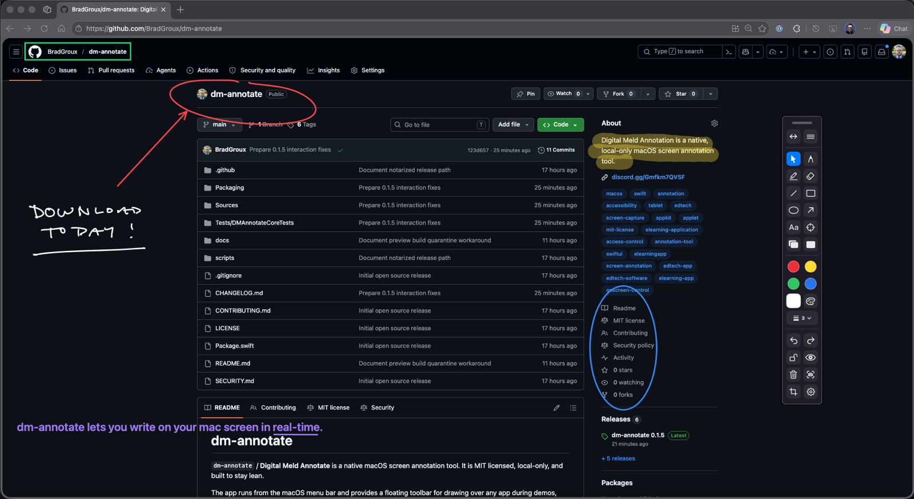
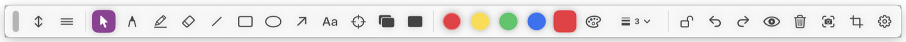
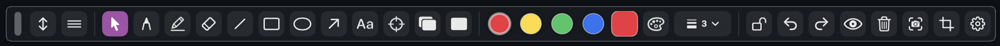
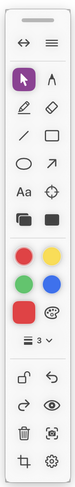
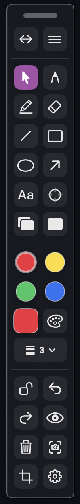
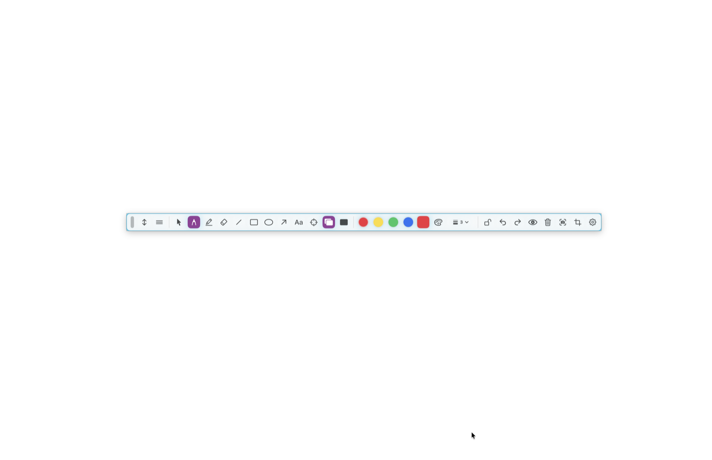
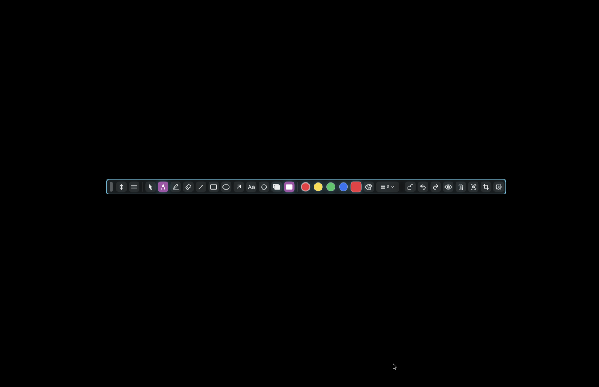

# Usage Guide

`dm-annotate` is designed for live annotation during demos, classes, design reviews, screen shares, and recordings.

<p align="center">
  
</p>

## Mac Requirements

- macOS 13 Ventura or later.
- Screen Recording permission for full-screen and region screenshots that include other apps behind annotations.
- Accessibility permission for reliable global shortcuts while another app is active.
- Input Monitoring may be required by macOS for global keyboard shortcuts, depending on OS version and security settings.

The onboarding window checks these permissions and links to the relevant **System Settings > Privacy & Security** panes. It refreshes when you return from System Settings. Reopen it from **Permissions...** in the app menu or menu bar item.

## Launch

Run from source:

```sh
swift run dm-annotate
```

Build and open a local app bundle:

```sh
scripts/build-app.sh
open ".build/Digital Meld Annotate.app"
```

> [!IMPORTANT]
> Current ad-hoc builds are not notarized. macOS Gatekeeper may block the first launch.
>
> After moving the app to `/Applications`, run:
>
> ```sh
> xattr -dr com.apple.quarantine "/Applications/Digital Meld Annotate.app"
> open "/Applications/Digital Meld Annotate.app"
> ```
>
> Only do this for builds you trust.

The app appears in the macOS menu bar and shows a floating toolbar.

## Install with Homebrew

The recommended install path is the dedicated `BradGroux/tap` Homebrew tap:

```sh
brew tap BradGroux/tap
brew install --cask dm-annotate
```

Homebrew installs use the current GitHub release artifact. Published Homebrew artifacts are Developer ID signed, notarized, and stapled.

## Permissions

macOS may require:

- Screen Recording: needed for screenshots that include underlying screen content.
- Accessibility: needed for global shortcut reliability and interaction recovery.
- Input Monitoring: may be needed by macOS for global keyboard handling.

The onboarding window shows current permission status, links to the relevant System Settings panes, and refreshes when the app becomes active again after you return from System Settings. Reopen it from **Permissions...** in the app menu or menu bar item.

Consumable global shortcuts use a native macOS event tap so app shortcuts do not leak into the foreground app. If macOS denies that event tap, `dm-annotate` falls back to normal global monitoring; grant Accessibility and confirm Input Monitoring if shortcuts are observed but not consumed.

## Toolbar

The floating toolbar supports:

- Dragging by the grip.
- Vertical and horizontal layouts.
- Compact presenter mode.
- Collapse/expand.
- A find/pulse action if the toolbar gets lost.
- Local layout presets in Settings.
- Tooltips on hover with shortcut labels where available.
- A cyan border when the app is actively controlling pointer input.

Collapsed mode intentionally shows only the drag grip and expand button.

### Toolbar Layouts

| Light horizontal | Dark horizontal |
| --- | --- |
|  |  |

| Light vertical | Dark vertical |
| --- | --- |
|  |  |

## Drawing and Click-through

- Cursor mode passes pointer events through to apps underneath.
- Select mode captures pointer input for editing placed annotations.
- Drawing tools capture pointer input on the overlay.
- Press `Escape` once to exit drawing controls and return to cursor mode.
- Press `Escape` twice quickly to quit.
- Press `Command+Q` while the app is focused to quit.

## Tools

Supported tools:

- Cursor
- Select
- Pen
- Highlighter
- Eraser
- Line
- Rectangle
- Ellipse
- Arrow
- Text
- Laser pointer
- Whiteboard
- Blackboard

Text annotations support:

- Plain `Enter` to commit the text annotation.
- `Shift+Enter` to insert a newline.
- Auto-expanding text entry as the sentence grows.
- Dragging existing text with the Text tool.
- Text style controls for font size, custom size, weight, and color.

Select mode supports:

- Selecting placed annotations.
- Moving a selected annotation.
- Deleting a selected annotation with `Delete`.
- Recoloring a selected annotation from toolbar color controls.
- Resizing selected strokes and shapes from toolbar stroke controls.

Whiteboard and blackboard controls toggle white and black presentation backgrounds. Settings can still choose light grid or dark grid board backgrounds.

| Whiteboard | Blackboard |
| --- | --- |
|  |  |

## Colors, Stroke Width, and Text Style

The toolbar includes:

- A 10-color editable toolbar palette.
- A custom color swatch that opens the macOS color panel.
- Saved palettes that can be reloaded later.
- Stroke presets from `1` through `64` px plus a custom stroke width entry.
- A text style popover with font size presets, custom font size, font weight, and text color.

The first four palette colors are mapped to Command+1 through Command+4 by default. Palette colors and the default color can be changed in Settings.

## Screenshots

Screenshot actions include:

- Full-display screenshot using the configured default output.
- Region screenshot with crosshair guide lines while selecting.
- Copy flattened PNG to clipboard.
- Save flattened PNG to disk.
- Save transparent annotation-only PNG for layering in another editor.
- Reveal the last saved screenshot in Finder.

The default folder is `~/Downloads`.

Screenshot filename format:

```text
dm-annotate-YYYYMMDD-HHMMSS.png
```

## Settings

Settings include:

- Theme.
- Toolbar orientation and collapsed state.
- Compact presenter mode and local toolbar presets.
- High contrast toolbar.
- Toolbar tooltips.
- Visible tools.
- Screenshot output and folder.
- Whiteboard background.
- Default color, toolbar palette, and saved palettes.
- Keyboard shortcuts with duplicate detection and disable support.
- Community links for SSTB.ai, the Start Small, Think Big podcast playlist, and Discord.
- Help, version, permission, and diagnostics links.

## Annotation Sessions

Use **File > Save Annotation Session...** to write the current annotations to a local `.dmannotate-session` file. Use **File > Load Annotation Session...** to restore one later.

Session files contain annotation geometry, display IDs, colors, stroke widths, text styles, visibility, lock state, and whiteboard state. If a saved display is missing when loading, annotations are retargeted to the current main display. Session files stay local and are not synced by the app.

## Safe Mode

Hold `Shift` while launching to start in Safe Mode. Safe Mode disables overlays and global shortcuts so you can recover from bad settings or permission issues.

If the previous run exited abnormally, the next launch starts in cursor mode and recenters the toolbar.
